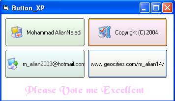

<div align="center">

## XP\_Button


</div>

### Description

Makes a XP button for new applications for you who wants to be updated.
 
### More Info
 


<span>             |<span>
---                |---
**Submitted On**   |2004-02-13 01:57:58
**By**             |[The MOLiSoft team](https://github.com/Planet-Source-Code/PSCIndex/blob/master/ByAuthor/the-molisoft-team.md)
**Level**          |Advanced
**User Rating**    |4.9 (39 globes from 8 users)
**Compatibility**  |VB 6\.0
**Category**       |[Files/ File Controls/ Input/ Output](https://github.com/Planet-Source-Code/PSCIndex/blob/master/ByCategory/files-file-controls-input-output__1-3.md)
**World**          |[Visual Basic](https://github.com/Planet-Source-Code/PSCIndex/blob/master/ByWorld/visual-basic.md)
**Archive File**   |[XP\_Button1708142132004\.zip](https://github.com/Planet-Source-Code/the-molisoft-team-xp-button__1-51702/archive/master.zip)

### API Declarations

```
CreatePen
MoveToEx
LineTo
FillRect
FrameRect
SetPixel
CreateRectRgn
CombineRgn
SetWindowRgn
StretchBlt
CreateSolidBrush
BitBlt
SetBkColor
CreateCompatibleDC
DeleteDC
CreateCompatibleBitmap
SelectObject
DeleteObject
GetSysColor
SetTextColor
CreateBitmap
GetBkColor
GetTextColor
SelectPalette
RealizePalette
DrawState
PlaySound
SetCapture
WindowFromPoint
GetCursorPos
DrawTextEx
DrawFocusRect
ShellExecute
'Don't you think these a lot API
'Function doesn't have the right of
'Excellent Vote.
```


